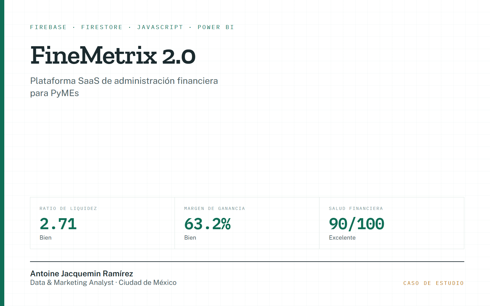

# Portafolio — Antoine Jacquemin Ramírez

Sitio estático de una página. Sin dependencias, sin build: es HTML y CSS.

```
index.html                          la página completa
assets/
  ecommerce-sales-intelligence.png  dashboard del caso de e-commerce
  caso-ecommerce-sales-intelligence.pdf
  CV-Antoine-Jacquemin-ES.pdf       el botón "Descargar CV"
  CV-Antoine-Jacquemin-EN.pdf       el botón "CV en inglés"
proyectos/
  growth-analytics-fintech.html     dashboard interactivo enlazado desde la tarjeta
```

## Faltan 4 capturas

Cuatro tarjetas muestran hoy un marcador gráfico en lugar de la imagen del dashboard.
Para completarlas, guarda cada captura en `assets/` con estos nombres exactos:

| Tarjeta | Archivo esperado |
|---|---|
| FineMetrix 2.0 | `assets/finemetrix.png` |
| Inteligencia para Cartera | `assets/cartera.png` |
| Operación Multi-sucursal | `assets/multisucursal.png` |
| Customer Health Score | `assets/customer-health-score.png` |

Después, en `index.html`, sustituye el bloque `<div class="thumb-blank">…</div>` de esa
tarjeta por:

```html

```

Cada tarjeta ya tiene un comentario HTML en su sitio recordando el nombre del archivo.
Formato recomendado: PNG o JPG, ancho de 1200–1600 px. Las miniaturas se recortan a 16:10
desde el borde superior, así que la parte importante del dashboard conviene que esté arriba.

## Ver el sitio en local

Basta abrir `index.html` en el navegador. Si prefieres servirlo:

```bash
python -m http.server 8000
```

Y entra a http://localhost:8000

## Publicar en GitHub Pages

1. Crea un repositorio **público** en GitHub llamado `portafolio` (o el nombre que quieras).
2. Desde esta carpeta:

```bash
git remote add origin https://github.com/USUARIO/portafolio.git
```

```bash
git push -u origin main
```

3. En GitHub: **Settings → Pages → Source: Deploy from a branch → Branch: `main` / `(root)`** y guarda.
4. En un par de minutos el sitio queda en `https://USUARIO.github.io/portafolio/`.

Sustituye `USUARIO` por tu usuario de GitHub. Cada `git push` posterior actualiza el sitio.
